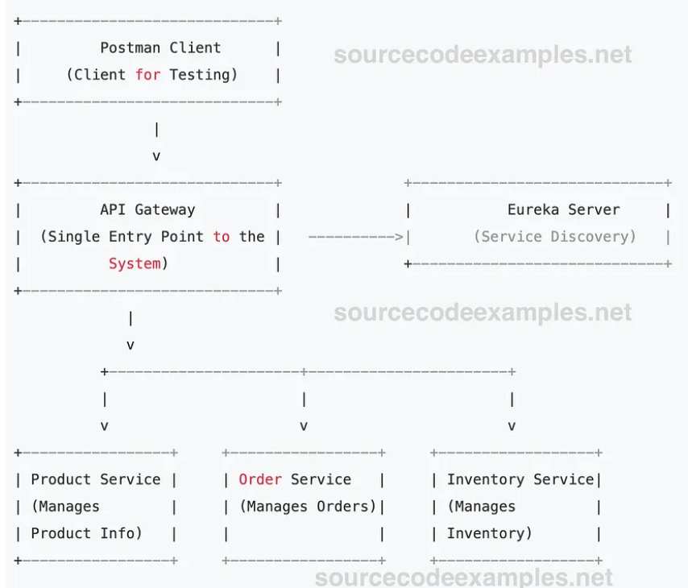

#EcommerceBasic
# Aplicación de Comercio Electrónico con Microservicios

Este proyecto es una aplicación de comercio electrónico desarrollada utilizando una arquitectura de microservicios con **Spring Boot** y **Spring Cloud**. La aplicación permite gestionar productos, pedidos e inventarios de manera independiente a través de microservicios, lo que facilita la escalabilidad y el mantenimiento.

## Tabla de Contenidos

1. [Descripción del Proyecto](#descripción-del-proyecto)
2. [Arquitectura de Microservicios](#arquitectura-de-microservicios)
3. [Requisitos Previos](#requisitos-previos)
4. [Configuración e Instalación](#configuración-e-instalación)
5. [Guía de Uso](#guía-de-uso)
6. [Endpoints Principales](###Endpoints)


## Descripción del Proyecto

Esta aplicación de comercio electrónico permite realizar las siguientes operaciones:

- **Gestión de Productos**: Crear, consultar, actualizar y eliminar productos.
- **Gestión de Pedidos**: Realizar pedidos, consultar el estado de los pedidos y actualizar sus detalles.
- **Gestión de Inventario**: Verificar la disponibilidad de productos en el inventario.

Cada funcionalidad está implementada en un microservicio independiente para maximizar la modularidad.

## Arquitectura de Microservicios

La aplicación se organiza en los siguientes microservicios:

- **API Gateway**: Actúa como un punto de entrada único, enruta las solicitudes a los microservicios correspondientes.
- **Eureka Server**: Descubrimiento de servicios que permite la autocomunicación entre microservicios.
- **Product Service**: Gestiona los detalles de productos (nombre, precio, disponibilidad).
- **Order Service**: Gestiona la creación y actualización de pedidos.
- **Inventory Service**: Gestiona la disponibilidad de los productos en stock.
  ## Diagrama de arquitectura simplificado:

## Requisitos Previos

- **JDK 17** o superior
- **Maven** o **Gradle**
- **Docker** y **Docker Compose** (opcional para desplegar en contenedores)
- IDE como **IntelliJ IDEA** o **Eclipse**

## Configuración e Instalación

1. **Clonar el repositorio**:
   ```bash
   git clone https://github.com/tu_usuario/mi-proyecto-ecommerce.git
   cd mi-proyecto-ecommerce
# Endpoints de la Aplicación de Microservicios

Esta sección documenta los principales endpoints disponibles en los microservicios de la aplicación de comercio electrónico. Los endpoints son accesibles a través del API Gateway, por lo que puedes acceder a ellos utilizando la URL base `http://localhost:8080`.

## Tabla de Contenidos

1. [Product Service](#product-service)
2. [Order Service](#order-service)
3. [Inventory Service](#inventory-service)

---

## Product Service

El microservicio **Product Service** se encarga de gestionar los productos en el sistema.

- **URL Base**: `/products`

### Endpoints

| Método | Endpoint            | Descripción                       |
|--------|----------------------|-----------------------------------|
| GET    | `/products`         | Lista todos los productos.        |
| POST   | `/products`         | Crea un nuevo producto.           |
| GET    | `/products/{id}`    | Obtiene un producto por su ID.    |
| PUT    | `/products/{id}`    | Actualiza un producto existente.  |
| DELETE | `/products/{id}`    | Elimina un producto.              |

### Ejemplo de Solicitud

- **GET** `/products`
    - Descripción: Obtiene una lista de todos los productos.

- **POST** `/products`
    - Descripción: Crea un nuevo producto en el sistema.
    - Body de Ejemplo:
      ```json
      {
        "nombre": "Producto Ejemplo",
        "precio": 100.0,
        "descripcion": "Descripción del producto ejemplo",
        "cantidadDisponible": 50
      }
      ```

---

## Order Service

El microservicio **Order Service** permite gestionar los pedidos realizados en el sistema.

- **URL Base**: `/orders`

### Endpoints

| Método | Endpoint            | Descripción                          |
|--------|----------------------|--------------------------------------|
| POST   | `/orders`           | Crea un nuevo pedido.               |
| GET    | `/orders/{id}`      | Consulta un pedido por su ID.       |
| PUT    | `/orders/{id}`      | Actualiza el estado de un pedido.   |

### Ejemplo de Solicitud

- **POST** `/orders`
    - Descripción: Crea un nuevo pedido en el sistema.
    - Body de Ejemplo:
      ```json
      {
        "clienteId": "12345",
        "productos": [
          { "productoId": "1", "cantidad": 2 },
          { "productoId": "2", "cantidad": 1 }
        ]
      }
      ```

- **GET** `/orders/{id}`
    - Descripción: Obtiene los detalles de un pedido específico utilizando su ID.

---

## Inventory Service

El microservicio **Inventory Service** maneja el inventario de productos.

- **URL Base**: `/inventory`

### Endpoints

| Método | Endpoint                   | Descripción                                 |
|--------|-----------------------------|---------------------------------------------|
| GET    | `/inventory/{productId}`    | Consulta la disponibilidad de un producto.  |
| PUT    | `/inventory/{productId}`    | Actualiza el stock de un producto.          |

### Ejemplo de Solicitud

- **GET** `/inventory/{productId}`
    - Descripción: Consulta la cantidad disponible de un producto específico.

- **PUT** `/inventory/{productId}`
    - Descripción: Actualiza el stock de un producto.
    - Body de Ejemplo:
      ```json
      {
        "cantidadDisponible": 100
      }
      ```

---

**Nota**: Estos endpoints deben estar accesibles a través del API Gateway configurado. Asegúrate de que los microservicios estén registrados en el servidor de Eureka para el enrutamiento adecuado.

